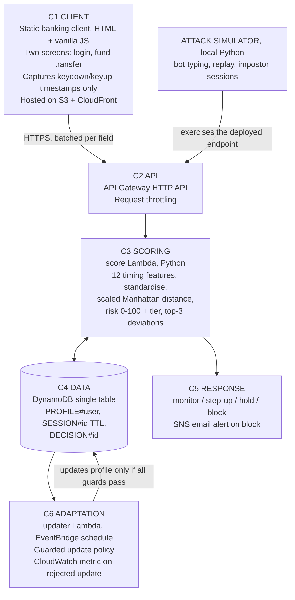

# fraud-detection-behavioural-biometrics

> Repository name: `fraud-detection-behavioural-biometrics`

## 1. Project Title

**Personal Financial Fraud Detection Framework using Behavioural Biometrics**

*Keystroke-Dynamics Continuous Authentication with a Poisoning-Resistant Adaptive Profile, Deployed Serverlessly on AWS*

- **Course:** Cloud Computing (Project Component)
- **Deployment platform:** Amazon Web Services (AWS)
- **Institution:** SCORE, Vellore Institute of Technology, Vellore
- **Guide:** Dr. Priya V

## 2. Team Members

| Name | Registration number | Role |
| --- | --- | --- |
| Aditya Shukla | 23BIT0250 | Cloud architecture and deployment |
| Arushi Tiwari | 23BIT0181 | Behavioural modelling and the poisoning experiment |

## 3. Problem Statement

Traditional financial fraud detection relies on transaction history, OTPs, passwords and device authentication. These methods often fail when attackers obtain legitimate credentials through phishing, malware, SIM swapping or social engineering, because once the credential check is passed the session is trusted for its entire lifetime.

Four specific weaknesses motivate this work:

1. **Authentication is an event, not a state.** Verification happens once at login, so account takeover after successful login is invisible to the system.
2. **Detection is retrospective.** Rule based and transaction only models typically flag fraud after the transaction is submitted, when financial loss has already occurred.
3. **Decisions are opaque and binary.** A "fraud detected" flag with no reasoning creates high false positive friction for genuine customers and gives analysts nothing to act on.
4. **Adaptivity introduces its own attack surface, and this is unexamined.** Any behavioural system deployed for more than a few weeks must let user profiles evolve, otherwise genuine behavioural change is misread as attack. But an update mechanism that accepts sessions it judges genuine can be fed sessions that are deliberately just genuine enough. The literature proposes adaptive profiling as a solution to false positives without asking what it costs in security.

> Weakness 4 is the core question of this project. Adaptivity as an unexamined attack surface is the gap the work is built around (see [docs/research-gap.md](docs/research-gap.md), RG3).

## 4. Objectives

**O1.** Implement a browser based keystroke capture layer for a simulated banking client that records timing and dynamics only, discarding key identity and never transmitting typed content.

**O2.** Build a serverless ingestion and scoring pipeline on AWS using only always free services, with no idle cost and no provisioned infrastructure.

**O3.** Engineer a 12 feature keystroke representation (key hold times, inter key flight times, total entry duration, correction rate), build per user reference profiles, and score sessions using a scaled Manhattan distance over standardised features. Report Equal Error Rate, FAR and FRR on the CMU keystroke benchmark against the published baseline for that dataset.

**O4.** Implement a risk engine that maps the anomaly score to a calibrated 0 to 100 value and four graded response tiers, and returns a feature level explanation identifying the highest contributing features by standardised deviation, with direction and magnitude.

**O5. (PRIMARY RESEARCH OBJECTIVE)** Characterise the profile poisoning attack against adaptive behavioural authentication, implement a guarded update policy as a defence, and quantify the tradeoff between poisoning resistance and false rejection rate under genuine behavioural drift.

**O6.** Build an attack simulator generating three adversarial session classes (constant interval bot typing, session replay, and impostor sessions drawn from other benchmark subjects), and report detection rate per class alongside measured end to end scoring latency and cost per thousand sessions on the deployed system.

## 5. Proposed Architecture / Framework



**C1 Client.** A static simulated internet banking client of two screens, login and fund transfer, written in plain HTML and vanilla JavaScript. It records keydown and keyup timestamps only. Key identity is discarded in the browser and typed content is never transmitted. It is served from Amazon S3 behind CloudFront.

**C2 API.** An API Gateway HTTP API is the single public entry point, with request throttling applied at the stage level.

**C3 Scoring.** The score Lambda extracts the 12 timing features, reads the caller's reference profile, standardises the feature vector against it, computes a scaled Manhattan distance, and maps that distance to a risk value from 0 to 100 with a response tier and the three highest deviating features.

**C4 Data.** A single DynamoDB table holds three item types: `PROFILE#<user>` for reference statistics, `SESSION#<id>` for raw submitted feature vectors under a TTL, and `DECISION#<id>` for the scored outcome and its explanation. See [database/schema.md](database/schema.md).

**C5 Response.** The tier drives one of four graded, reversible responses: silent monitoring, step up re-authentication, transaction hold, and block with alert. A block publishes an SNS email alert.

**C6 Adaptation.** An updater Lambda on an EventBridge schedule applies the guarded update policy, conditioning every profile update on sustained low risk and on the absence of credential, device or authentication anomalies. Every rejected update emits a CloudWatch metric.

**Attack simulator.** A local Python simulator exercises the deployed endpoint with bot typing, replayed sessions and impostor sessions drawn from other benchmark subjects.

Full component-by-component description: [docs/architecture-diagram.md](docs/architecture-diagram.md).

## 6. Technology Stack

| Layer | Technology |
| --- | --- |
| Client | HTML5, vanilla JavaScript, no framework or build step |
| Hosting | Amazon S3 static website, Amazon CloudFront |
| API | Amazon API Gateway (HTTP API) |
| Compute | AWS Lambda, Python 3.12 |
| Storage | Amazon DynamoDB, single-table design |
| Scheduling | Amazon EventBridge Scheduler |
| Alerting | Amazon SNS |
| Observability | Amazon CloudWatch |
| Offline analysis | Python 3, numpy, pandas, scikit-learn, matplotlib, Jupyter |

## 7. Dataset Details

**Dataset.** The CMU keystroke dynamics benchmark, DSL-StrongPasswordData (Killourhy and Maxion, 2009). 51 subjects, one fixed password, 400 repetitions each across 8 sessions.

**Why it was chosen.** It supplies genuine impostor data from real humans, requires no participant recruitment or ethics approval, and has a published error rate baseline that makes this project's numbers directly comparable to prior work rather than free floating. The published baseline for the best performing detector on this dataset should be quoted from the source paper and used as the comparison point.

**Datasets considered and not used.**

| Dataset | Reason for exclusion |
| --- | --- |
| Buffalo and Clarkson free text keystroke corpora | Needed for genuine continuous session authentication, deferred to future work |
| Balabit mouse dynamics, Touchalytics | No shared subjects with any keystroke corpus, so multimodal fusion would be fabricated |
| IEEE-CIS, PaySim | No behavioural signal, and the supervised branch has been dropped |

**Scope limit.** The benchmark is a fixed credential string, so the evaluated claim covers credential entry and step-up re-authentication, not free-text continuous session authentication.

**Evaluation metrics.**

| Category | Metrics |
| --- | --- |
| Detection | Equal Error Rate, FAR, FRR, ROC curve, compared against the published benchmark baseline |
| Poisoning | Sessions to successful impersonation, per update policy; profile displacement over time; resistance against false rejection tradeoff curve |
| Adaptation | False rejection rate under injected genuine drift, with and without adaptation |
| Robustness | Detection rate per attack class (bot typing, replay, impostor) |
| Cloud | End to end scoring latency at p50 and p95, reported separately for warm and cold Lambda invocations; measured cost per thousand sessions |

## 8. Repository Structure

```
.
├── README.md                          This file
├── .gitignore
├── frontend/                          Static simulated banking client
│   └── src/                           Capture JavaScript and page markup
├── backend/                           Serverless application code
│   ├── lambdas/
│   │   ├── score/                     Per session scoring Lambda
│   │   └── updater/                   Scheduled guarded profile updater
│   └── shared/                        Feature and scoring module shared by Lambda and offline analysis
├── ai-models/                         Offline behavioural modelling track
│   ├── feature-extraction/            The 12 keystroke timing features
│   ├── profiling/                     Per user reference profile statistics
│   └── experiments/                   Evaluation, poisoning and guarded update experiments
├── database/                          DynamoDB single-table design
│   └── schema.md                      Item types, key schema and access patterns
├── data/                              Dataset workspace, contents not committed
│   ├── raw/                           CMU benchmark as downloaded
│   └── processed/                     Derived feature matrices and profiles
├── docs/                              Project documentation
│   ├── project-documentation.md       Full source document
│   ├── literature-survey.md           15 paper survey and thematic synthesis
│   ├── research-gap.md                RG1 to RG5 and the consolidated gap statement
│   ├── work-distribution.md           Responsibilities and per folder ownership
│   └── architecture-diagram.md        Architecture diagram and component descriptions
├── results/                           Experimental output
│   ├── figures/                       Plots, including the headline tradeoff curve
│   └── tables/                        Numeric result tables
└── presentation/                      Review slides and demonstration recording
```

## 9. Work Distribution

| Team member | Registration no. | Contribution area |
| --- | --- | --- |
| Aditya Shukla | 23BIT0250 | Serverless architecture and AWS service mapping, service exclusion and cost analysis, browser capture layer, API Gateway and score Lambda, DynamoDB schema, SNS alerting, scheduled updater Lambda, attack simulator, latency and cost measurement, research gap analysis and scope-narrowing justification |
| Arushi Tiwari | 23BIT0181 | Literature survey and thematic synthesis, CMU dataset processing, 12-feature extraction and per-user profiling, scaled Manhattan scoring and calibration, EER, FAR and FRR evaluation, threat model formalisation, poisoning attack and guarded update policy, tradeoff curve and drift injection experiments |

Full responsibilities table, shared responsibilities and the per-folder ownership map: [docs/work-distribution.md](docs/work-distribution.md).
