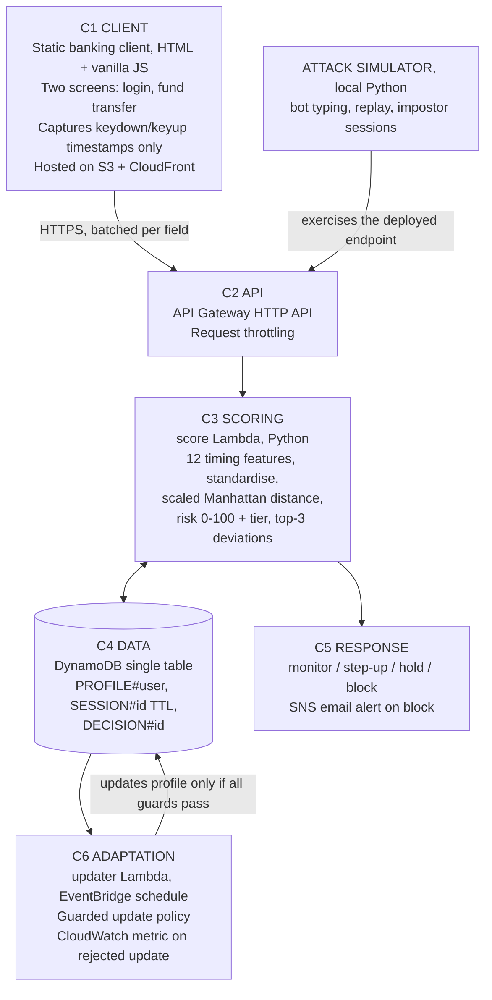

# Architecture Diagram

## Two track structure

The project is built as two deliverables that do not depend on each other.

| Track | What it is | Produces |
| --- | --- | --- |
| Track 1: Offline experiment | Python notebook over the CMU keystroke benchmark. Feature extraction, per user profiles, scoring, error rates, and the full poisoning and guarded update experiment | The research result: EER against the published baseline, and the poisoning resistance curve |
| Track 2: Live deployment | Serverless AWS pipeline serving the same scoring logic to a browser client, exercised with the team's own sessions and the attack simulator | The cloud result: a working demonstration plus measured latency and cost |

The two tracks share exactly one piece of code, the feature and scoring module in
[../backend/shared/](../backend/shared/README.md), which is what makes the offline error rates a
statement about the deployed system.

## Deployed architecture

## Components

### C1 Client

A simulated internet banking client of two screens, login and fund transfer, written in HTML5 and
vanilla JavaScript with no framework and no build step, hosted as an Amazon S3 static website behind
Amazon CloudFront.

The capture layer registers keydown and keyup handlers and records timestamps only. Key identity is
discarded at capture time and typed content is never transmitted, which is objective O1 and the
privacy property the design depends on: the payload leaving the browser cannot reconstruct the
password. Timing vectors are batched per field and posted over HTTPS.

Implemented in [../frontend/](../frontend/README.md).

### C2 API

An Amazon API Gateway HTTP API is the single public entry point. HTTP API is chosen over REST API
because it is cheaper per request and lower latency, and the project needs neither request
validation models nor usage plans. Stage level request throttling limits the rate at which any
client, including the attack simulator, can submit sessions.

### C3 Scoring

The score Lambda (Python 3.12) is invoked synchronously per submitted session. It extracts the 12
timing features, reads `PROFILE#<user>` from DynamoDB, standardises each feature against the profile
mean and standard deviation, computes the scaled Manhattan distance, and calibrates that distance to
a risk value from 0 to 100.

The response carries the risk value, the response tier, and the three features whose standardised
deviation contributed most, each with direction and magnitude. That explanation is objective O4 and
the answer to gap RG4: an analyst is told which timing behaviour changed, not merely that something
did.

Implemented in [../backend/lambdas/score/](../backend/lambdas/score/README.md).

### C4 Data

One Amazon DynamoDB table in single-table design holds three item types: `PROFILE#<user>` for
reference statistics, `SESSION#<id>` for submitted feature vectors under a TTL, and `DECISION#<id>`
for scored outcomes and their explanations. The profile read on the scoring path is a single
`GetItem`, which keeps the latency budget in objective O6 achievable.

Full key schema and access patterns: [../database/schema.md](../database/schema.md).

### C5 Response

The tier maps to one of four graded, reversible responses:

| Tier | Response |
| --- | --- |
| monitor | Silent monitoring, the session proceeds unchanged |
| step-up | Step up re-authentication before the action completes |
| hold | Transaction hold pending review |
| block | Block, with an Amazon SNS email alert |

Every tier is reversible, so a false positive costs friction rather than a lost customer. Threshold
values for each tier: TODO, pending calibration.

### C6 Adaptation

The updater Lambda runs on an Amazon EventBridge Scheduler schedule and is the component the research
question is about. It considers recent sessions as candidates for updating a user's reference profile
and applies the guarded update policy: an update proceeds only on sustained low risk and in the
absence of credential, device or authentication anomalies. A single low risk session is never enough,
which is what denies the poisoning adversary the incremental drag described in RG3.

Every rejected update emits an Amazon CloudWatch metric, so a poisoning campaign is visible as a
rising rejection rate rather than being silently absorbed. Guard thresholds: TODO, to be set from the
tradeoff curve.

Implemented in [../backend/lambdas/updater/](../backend/lambdas/updater/README.md).

### Attack simulator

A local Python simulator that exercises the deployed endpoint through C2 with three adversarial
session classes: constant interval bot typing, session replay, and impostor sessions drawn from other
benchmark subjects. Detection rate is reported per class (objective O6, gap RG5). It runs against the
live deployment rather than offline, so the numbers describe the deployed system including its
throttling.

### Observability and cost

Amazon CloudWatch collects Lambda duration, cold start counts and the rejected update metric. End to
end scoring latency is reported at p50 and p95, separately for warm and cold invocations, alongside
measured cost per thousand sessions. Every service in the stack is selected to sit within the AWS
always free tier, so idle cost is zero and no infrastructure is provisioned (objective O2).
