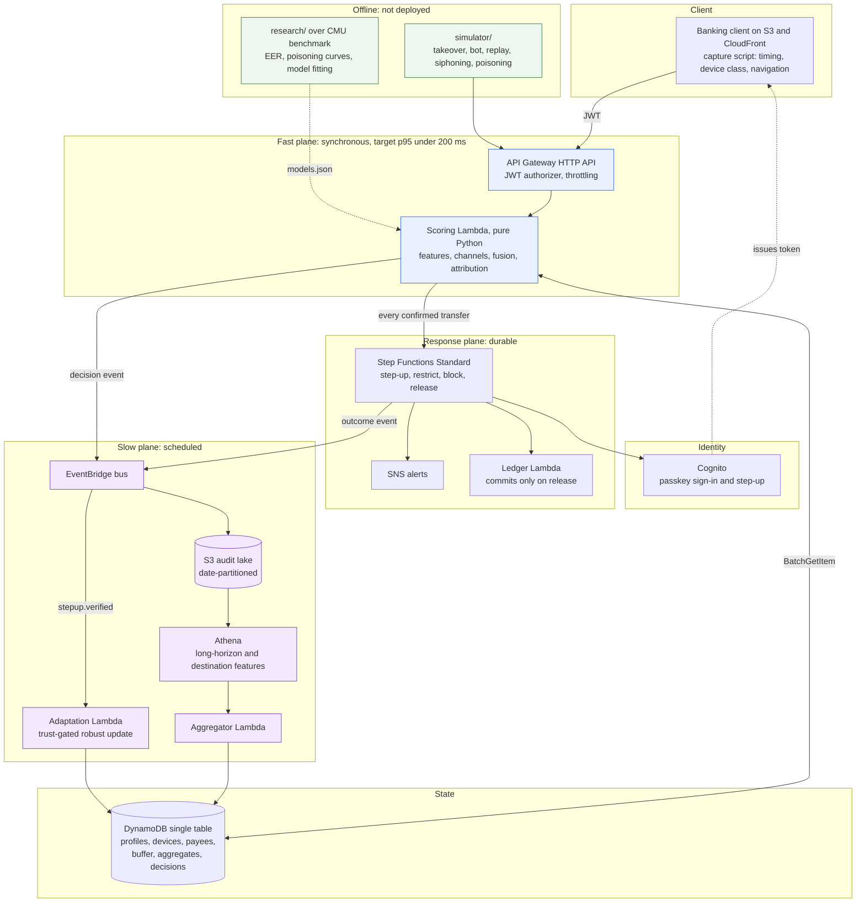

# Architecture

Design of record for `behavioural-fraud-detection`. This document explains what the system is, how it is put together, and why each decision was made. `CLAUDE.md` is the operating manual and takes precedence for conventions; this file takes precedence for design.

Scope boundary: social engineering, scam detection, coercion and intent inference are out of scope. The threat model is attacker-driven fraud only.

---

## 1. Objective and threat model

The system detects fraudulent financial transactions by combining behavioural biometrics (keystroke timing), transaction characteristics, device and session context, payee history, and cross-session patterns. It does not judge a transaction in isolation.

Three attack classes, plus one attack against the system itself.

**A. Account takeover.** An attacker holds valid credentials and operates the account. Signals: unfamiliar typing, new device, new payee, unusual amounts, deviation from the user's own baseline. Response: step-up authentication, restriction, block.

**B. Bot, replay and automation.** Scripted input or replayed interaction. Signals: implausibly regular intervals, low coefficient of variation in inter-key timing, exact-duplicate sequences, abnormally fast actions.

**C. Low-and-slow siphoning.** Many individually unremarkable transfers to a destination the attacker controls, over days or weeks. No single transaction is anomalous; the aggregate is. Signals: cumulative volume to recently added payees, regular transfer intervals, amounts clustered just below thresholds, identity scores that are consistently worse on sessions involving one payee, and destination accounts receiving from many unrelated senders.

**D. Profile poisoning.** An attacker with account access submits sessions engineered to be accepted by the profile update rule, gradually dragging the victim's reference profile toward their own behaviour until they authenticate freely. This is an attack on the adaptation mechanism rather than on a transaction, and defending it is the project's research contribution.

---

## 2. Design principles

1. **Behaviour is evidence, not a verdict.** A behavioural anomaly contributes to a score; it never decides an outcome alone. This is enforced as the friction ceiling in section 8.3.
2. **The slow plane never blocks the fast plane.** Every cross-timescale interaction is a key lookup of a precomputed value, never a computation.
3. **Trust must come from outside the channel being trusted.** Evidence authorising a profile update must not derive from the behavioural channel that the update modifies.
4. **Confidence travels with every score.** Weak evidence produces a shrunk contribution, not a confident guess.
5. **One implementation of the decision logic.** `src/fraudcore/` is imported by both the Lambdas and the research notebooks, so deployed behaviour and evaluated behaviour cannot diverge.
6. **Fail open.** A dependency failure degrades to monitoring, never to blocking.

---

## 3. System overview

Three planes.

**Fast plane, synchronous.** API Gateway to one scoring Lambda to DynamoDB and back. Reads precomputed state, computes channel scores, fuses them, writes a decision, returns score, contributions, confidence and action.

**Response plane, asynchronous and durable.** A Step Functions Standard workflow handling step-up authentication, temporary restriction, blocking, release and analyst notification, with a mock ledger that commits only on release.

**Slow plane, asynchronous and scheduled.** EventBridge fans decision events into an S3 audit lake. A scheduled aggregator computes long-horizon and destination features in Athena and writes them back into DynamoDB. A separate adaptation path applies the poisoning-resistant profile update, triggered only by verified step-up events.



### Plain-English walkthrough

A user signs in with a passkey. As they type into the transfer form, the client collects timing data plus a small amount of device and navigation information, and sends it at checkpoints.

One Lambda receives that. In a single database read it pulls the user's typing profile for this class of device, the devices it has seen before, this payee's history with this user, this payee's risk as computed overnight, and the user's rolling aggregates.

It then asks four questions. Does this typing match the profile? Does the timing look machine-generated or replayed? Is this transaction unusual for this person on this device? Is this destination suspicious, for this user or across all users? Each produces a score and a confidence, because a short password gives weak evidence and a new user gives almost none.

Those scores are combined by a logistic model into a number from 0 to 100, with the three strongest contributors named. Low risk passes, medium triggers a passkey re-check, high restricts or blocks.

Everything expensive happens afterwards. Decisions become events, archived to S3. Overnight, queries compute what cannot be seen inside one session: cumulative money to recent payees, suspiciously regular transfer intervals, amounts hugging a threshold, destinations collecting money from many unrelated senders. Results are written back so the next session reads them instantly. Separately, the typing profile is updated, but only under the constraints in section 7.

---

## 4. Components

| Component | Runtime | Responsibility | Explicitly not responsible for |
|---|---|---|---|
| Capture script | Browser, vanilla JS | Timing deltas, coarse device class, navigation ordering, batched POST at checkpoints | Any typed content or key identity |
| Scoring Lambda | Python 3.12, ARM64, 512 MB, pure Python | Feature extraction, channel scores, fusion, attribution, decision write, event publish | Profile updates, batch features, waiting |
| Response workflow | Step Functions Standard | Step-up orchestration, timeouts, restriction, block, release, ledger commit | Scoring |
| Adaptation Lambda | Python 3.12 | Trust score, buffer maintenance, robust recomputation, budget projection | Live transaction decisions |
| Aggregator Lambda | Python 3.12 | Runs Athena queries, writes long-horizon and payee risk items | Real-time decisions |
| Ledger Lambda | Python 3.12 | Mock balances, commits on release only | Risk logic |
| `research/` | Local, numpy allowed | CMU experiments, poisoning curves, fusion fitting, threshold calibration, all figures | Anything deployed |
| `simulator/` | Local Python | Attack traffic against the live endpoint | Being part of the system |

Two choices deserve emphasis.

**Per-device-class profiles.** Profiles are keyed by user and device class (desktop keyboard, mobile touch, tablet), not by user alone. Much of what naive systems call drift is a person switching from laptop to phone. Separating the profiles removes an entire class of false positive at no algorithmic cost.

**Confidence as a first-class output.** Every channel reports evidence sufficiency alongside its score: keystrokes captured, sessions in the profile, staleness of the payee risk computation. Fusion shrinks low-confidence channels toward the prior rather than trusting them, which is what stops a three-session-old profile from blocking anyone.

---

## 5. Flows

### 5.1 Real-time request flow

1. Client POSTs a checkpoint event with a Cognito JWT. API Gateway validates the token and applies per-user throttling.
2. Lambda validates payload shape, rejects implausible timing (negative deltas, impossible hold durations), derives the device class.
3. One `BatchGetItem` retrieves profile, device, user-payee edge, global payee risk and user aggregate items. Typically under 10 ms.
4. Feature extraction: 12 keystroke timing features; automation features (coefficient of variation of inter-key intervals, rolling-hash duplicate detection); transaction features (amount relative to the user's own distribution, hour, velocity); context features (device familiarity, days since credential or contact change); payee features (payee age, verification status, cumulative sent, global fan-in risk).
5. Four channel scores, each with a confidence.
6. Fusion into 0 to 100, top three contributions with sign and magnitude, overall confidence, action.
7. Write the decision item (TTL 30 days), publish a decision event, return. At the confirmation checkpoint, start the response workflow asynchronously for every transfer and return immediately rather than waiting on it. Allowed transfers pass straight through to release; the rest wait on step-up or review, or are cancelled. Routing every transfer through the workflow leaves one path to the ledger, so "money moves only on release" is enforced in one place instead of two.

Targets: p50 under 60 ms, p95 under 200 ms end to end, warm. Cold starts are reported separately and honestly, expected at 300 to 600 ms without numpy. X-Ray segments separate API Gateway, Lambda init, DynamoDB read, compute and write, because latency is a reported result and a single number is not a result.

### 5.2 Session-level flow

A session is a DynamoDB item accumulating state, not a separate service. Scoring runs at four checkpoints: after login, after payee entry, after amount entry, and at confirmation. Each appends features and rescores with everything accumulated so far.

This matters twice over. Keystroke evidence accumulates, so identity confidence rises through the session instead of resting on one short field. And session-level aggregates become available: total duration, correction count, navigation ordering, repeated payee entry.

Only the confirmation checkpoint can restrict or block. Earlier checkpoints may raise risk and pre-warm a step-up.

### 5.3 Asynchronous event flow

Every decision and workflow outcome is published to a custom EventBridge bus with a typed detail schema. Three rules consume it:

- All events to the S3 audit lake, date-partitioned.
- `stepup.verified` to the adaptation Lambda. This is the single most important rule in the system: it makes profile learning conditional on independent verification rather than on repetition.
- Actions `restrict` and `block` to SNS.

The value over direct invocation is that adding a consumer never touches the scoring Lambda.

### 5.4 Long-term batch flow

EventBridge Scheduler triggers the aggregator nightly and on demand. It runs Athena queries over the lake and writes results back to DynamoDB.

Per user and payee edge:
- Cumulative amount sent to payees added within 30 days.
- Transfer count and interval regularity per payee (coefficient of variation of gaps; near zero indicates scripted periodicity).
- Fraction of transfers whose amounts fall in a narrow band just below a step-up threshold.
- Mean identity score of sessions involving each payee, compared against the user's overall mean. A payee whose sessions score consistently worse on identity is the signature of a second person operating the account.

Per destination, across all users:
- Distinct senders in 7 and 30 days.
- Fraction of senders who added the account within 72 hours of first sending.
- Fan-in to fan-out ratio, and time from first inbound to first outbound.
- Sender-set overlap with already-flagged accounts.

These write to `PAYEE#<id> / RISK` and `AGG#<id> / WINDOW#<window>`. The fast path reads them by key at no computational cost.

**Retroactive detection is inherent here.** For siphoning, the batch layer detects after transfers have settled, so the response is account-level: freeze the payee edge, require re-verification, notify, review prior transfers. The metric "money lost before detection" is structurally nonzero for this class, and is reported as such.

---

## 6. Data model

Single DynamoDB table, on-demand capacity, one GSI.

| Entity | PK | SK | Key attributes |
|---|---|---|---|
| Profile | `USER#<uid>` | `PROFILE#<deviceclass>` | `features[12]`, `mu[12]`, `sigma[12]`, `anchor_mu[12]`, `anchor_sigma[12]`, `anchor_at`, `budget_used`, `n_sessions`, `version` |
| Trusted buffer | `USER#<uid>` | `BUF#<deviceclass>#<ts>` | `features[12]`, `trust`, `verified`, TTL 180 days |
| Device | `USER#<uid>` | `DEV#<device_id>` | `first_seen`, `session_count`, `passkey_bound`, `device_class` |
| Account | `USER#<uid>` | `ACCOUNT` | `session_count`, `credential_changed_at`, `contact_changed_at` |
| User-payee edge | `USER#<uid>` | `PAYEE#<pid>` | `first_seen`, `verified_at`, `txn_count`, `cum_amount`, `mean_identity_score`, `interval_cv` |
| Global payee risk | `PAYEE#<pid>` | `RISK` | `distinct_senders_7d`, `distinct_senders_30d`, `new_sender_fraction`, `fanin_fanout_ratio`, `risk_score`, `computed_at` |
| User aggregates | `AGG#<uid>` | `WINDOW#<window>` | `amount_p50`, `amount_p95`, `daily_count_p95`, `history_count`, `new_payee_volume_30d`, `hour_histogram`, `computed_at` |
| Session | `SESS#<sid>` | `META` | `uid`, keystroke timing fields so far, TTL 1 day |
| Decision | `DEC#<did>` | `META` | scores, confidences, contributions, action, TTL 30 days |
| Verified step-up | `USER#<uid>` | `VERIFIED#<decision_id>` | `transfer_id`, `method`, `verified_at`, `received_at`, TTL 180 days |
| Ledger balance | `LEDGER#<uid>` | `BALANCE` | `balance`, `opening` |
| Ledger transfer | `LEDGER#<uid>` | `TXN#<transfer_id>` | `status`, `amount`, `payee_id`, `decision_id`, `action`, `reason`, `task_token` while held |

GSI1: `GSI1PK = USER#<uid>`, `GSI1SK = TS#<iso8601>` over decision items, for chronological per-user queries during evaluation and demos.

Notes. User aggregates have their own partition rather than living under `USER#<uid>`. IAM can scope DynamoDB access by partition key but not by sort key, so a shared partition would force the aggregator's role to write `USER#` items, and nothing but convention would stop it overwriting a profile. With a separate partition, "the adaptation role is the only writer of profile items" is enforced by IAM. The buffer is stored as separate items rather than a list inside the profile, so eviction is a TTL rather than a read-modify-write. `version` supports optimistic concurrency on profile updates. Anchor values are stored alongside current values because the budget in section 7 is defined relative to the anchor, not the previous state.

---

## 7. Poisoning-resistant profile adaptation

This is the research core, so it is specified rather than described. Implementation lives in `src/fraudcore/adaptation.py`.

### 7.1 The failure being fixed

Naive adaptation is an exponentially weighted mean over sessions that scored as genuine:

```
if identity_score(x) < theta:  mu <- (1 - alpha) * mu + alpha * x
```

Two independent flaws. The acceptance test reads the same quantity being updated, so the system's judgement is the only guard on the system's judgement, and it is one the attacker can satisfy by construction. And an unweighted mean has a breakdown point of zero: a single sufficiently distant accepted point moves it, and a stream of them moves it without bound.

### 7.2 Principles

**Independence.** Evidence authorising an update must not derive from the behavioural channel being updated.

**Bounded displacement.** Genuine drift has a measurable rate. Movement faster than that rate is not drift, however confident each individual update was.

**Robust aggregation.** The estimator must have a nonzero breakdown point, so a minority of adversarial sessions cannot move it at all, rather than moving it a little each time.

### 7.3 Trust score

A product of independent gates, each in `[0, 1]`:

```
tau(s) = c_verify * c_device * c_stability * c_txn
```

- `c_verify`: 1.0 if a passkey step-up was completed in this session; 0.6 if the session began with passkey sign-in on an enrolled device; 0.3 for password-only.
- `c_device`: 1.0 if enrolled with at least 10 prior clean sessions; 0.5 if known but younger; 0.0 if new.
- `c_stability`: 0.0 if password, registered phone, email or passkey set changed within 7 days; 1.0 otherwise.
- `c_txn`: 1.0 if no transaction in the session exceeded the medium threshold **on transaction, context and payee channels only**; 0.5 if one did; 0.0 if any was restricted or blocked.

The restriction on `c_txn` is where the independence principle bites. Using the fused risk would reintroduce the behavioural channel and break the guarantee.

Multiplication rather than a weighted sum, because these are gates and not votes: any single zero must veto. A new device plus a recent password change is the exact signature of takeover, and no quantity of other evidence should override it.

### 7.4 Buffer admission

```
if tau(s) >= tau_min:            # default 0.5
    append (x_s, w = tau(s)) to BUF[user, device_class]
    evict oldest beyond M        # default 200
```

Sessions below `tau_min` are discarded, not down-weighted. A small weight times unlimited sessions is still unlimited influence.

### 7.5 Robust recomputation

Every `R` admitted sessions (default 20) or nightly, recompute the candidate profile as the weighted geometric median of the buffer via Weiszfeld iteration:

```
m_(k+1) = ( sum_i w_i * x_i / ||x_i - m_k|| ) / ( sum_i w_i / ||x_i - m_k|| )
```

with the standard guard for `x_i = m_k`, to tolerance 1e-6 or 100 iterations. Scale is the weighted median absolute deviation per feature.

The geometric median has a breakdown point of 0.5: an adversary controlling less than half the buffer weight cannot move the estimate arbitrarily far, however extreme their sessions. An exponentially weighted mean has a breakdown point of 0. This substitution converts "each poisoned session moves the profile a little" into "poisoned sessions below the majority threshold move it by a bounded amount".

### 7.6 Displacement budget and anchoring

Let `mu_anchor` be the profile at the last verified re-anchoring, with scales `sigma_anchor`. Displacement uses the same metric as scoring, so a unit of budget means the same thing as a unit of anomaly:

```
D(mu_cand, mu_anchor) = (1/F) * sum_f |mu_cand[f] - mu_anchor[f]| / sigma_anchor[f]
```

Accept with projection:

```
if D <= B:
    mu_new = mu_cand
else:
    mu_new = mu_anchor + (B / D) * (mu_cand - mu_anchor)
    emit CloudWatch metric budget_saturated{user, device_class}
```

Re-anchoring refreshes the budget and occurs when a session arrives with `tau = 1.0`, or after `T` days of continuous non-saturated operation (default 30). At re-anchoring, `mu_anchor <- mu_new`, `sigma_anchor <- sigma_new`, `budget_used <- 0`.

`B` is calibrated from measured genuine drift, not guessed. CMU's eight sessions per subject were recorded on separate days, so the distribution of genuine per-week displacement across all 51 subjects is computable, and `B` is set at its 95th percentile. Sweeping `B` produces the project's central tradeoff curve.

`budget_saturated` is itself a detector. A genuine user drifting naturally rarely saturates the budget; a poisoning attacker saturates it every epoch by construction, because moving as fast as policy permits is their objective.

`sigma` is bounded too, by its own budget `B_sigma` on the mean relative change of the scale, calibrated the same way from genuine drift. Inflating the scale is an evasion: a wide enough variance makes everything look normal and neutralises a budget that only constrains the mean. The two cannot share one budget, because centre displacement is a distance in scaled units and scale displacement is a relative change; the first poisoning run used one number for both, and that run is kept in `research/results` as the record.

### 7.7 Cold start

A new device class bootstraps from the first 5 sessions carrying `c_verify >= 0.6`. Until then the identity channel reports low confidence and fusion shrinks it, so a new device produces extra verification rather than blocks. That is correct behaviour: a new device is a context signal, and the context channel already handles it.

### 7.8 Adversary cost

Let `D0` be the initial scaled distance between the attacker's natural typing and the victim's profile.

Under naive EWMA with rate `alpha` and threshold `theta`, the attacker submits sessions positioned just inside `theta`; required sessions grow linearly in `D0 / (alpha * theta)`, with no verification requirement and no bound on final displacement.

Under this policy the attacker must satisfy three constraints at once:

1. Supply more than half the buffer weight within an epoch to move the geometric median at all, requiring more than `M/2` admitted sessions per epoch.
2. Reach `tau >= tau_min` on each, requiring an enrolled device with history and no recent credential change, with `tau` capped at 0.6 absent a passed step-up.
3. Achieve at least `ceil(D0 / B)` re-anchoring events, each requiring a device-bound passkey step-up.

Constraint 3 binds. It converts poisoning from an exercise in patience into an exercise in stealing a hardware-bound authenticator, which is the same barrier the rest of the system relies on. Constraints 1 and 2 ensure that failing constraint 3 yields bounded rather than gradual progress.

This is a cost argument supported by measurement, not a proof, and is reported as such.

### 7.9 Policies to implement and compare

| Policy | Admission | Estimator | Budget |
|---|---|---|---|
| P0 static | none | fixed at enrolment | none |
| P1 naive | identity score below threshold | EWMA | none |
| P2 trust-gated | `tau >= tau_min` | EWMA | none |
| P3 proposed | `tau >= tau_min` | weighted geometric median | anchored budget `B` |

P2 isolates the trust gate; P3 minus P2 isolates robust aggregation plus budget. Without P2 the result cannot be attributed to either half of the mechanism.

---

## 8. Risk fusion

Implementation in `src/fraudcore/fusion.py` and `src/fraudcore/policy.py`.

### 8.1 Method

Each channel `i` in {behaviour, automation, transaction, context, payee} emits a raw score `s_i` and a confidence `c_i` in `[0, 1]`.

```
z_i  = c_i * standardise(s_i)      # unknown channel: c_i = 0, so z_i = 0
L    = w_0 + sum_i w_i * z_i
risk = 100 * sigmoid(L)
```

Confidence is evidence sufficiency, not certainty of guilt: keystrokes captured, buffer size, payee-risk staleness, device history length. Shrinking toward zero makes an uninformative channel pull toward the base rate rather than in a random direction.

Outputs:

1. **Risk score**, `risk`.
2. **Contributions**, `w_i * z_i`, reported as the top three by absolute value with sign and magnitude. For a linear model this attribution is exact and is identical to what SHAP returns, so explainability needs no extra library or post-hoc approximation.
3. **Confidence**, `sum_i w_i * c_i / sum_i w_i`, reported separately from the score.
4. **Action**, from thresholds plus the constraints in 8.3.

### 8.2 Why logistic regression

Labels for anything beyond the identity channel are synthetic. A model with capacity to fit nonlinear structure will fit the structure of the simulator, and the improvement will be an artifact. Beyond that, coefficients are directly interpretable and auditable, calibration is straightforward (Platt or isotonic on a held-out split), and the deployed model is five coefficients and an intercept, so the Lambda carries no ML dependency.

Gradient boosting is evaluated as a comparison row in the ablation and reported. If it wins substantially on synthetic data, that is a finding about the simulator and is discussed as one. Bayesian fusion over conditionally independent likelihood ratios is attractive in theory but the independence assumption is clearly violated here (device and payee channels share information) and estimating the dependence structure needs data that does not exist for this project.

### 8.3 Hard constraints outside the model

Policy, deliberately not learned, because the model is fitted on synthetic labels and should not hold unbounded authority.

- **Friction ceiling.** The behavioural channel alone can never escalate beyond step-up. Restriction and blocking require at least one non-behavioural channel above threshold. This caps the worst-case cost of behavioural drift at one re-authentication.
- **Corroboration for block.** Blocking requires two channels above threshold, or one channel plus a batch-derived flag.

---

## 9. ML architecture by stage

| Stage | Method | Why not something heavier |
|---|---|---|
| Raw collection | Browser timing APIs | Nothing to learn |
| Feature extraction | Deterministic, 12 keystroke features plus channel features | Learned representations need volume that does not exist here |
| Profile generation | Weighted geometric median and MAD, per user and device class | Robustness is the requirement; a learned encoder has no breakdown-point guarantee |
| Behavioural scoring | Scaled Manhattan distance | Strongest detector on this dataset in the published benchmark, and it keeps results comparable |
| Automation scoring | Interval coefficient of variation, rolling-hash duplicate detection | Bots fail on statistical regularity; a classifier adds nothing and needs bot labels |
| Transaction scoring | Per-user empirical quantiles and robust z-scores | A model per user is infeasible; quantiles are stable at low volume |
| Context and payee scoring | Counts and ratios feeding fusion | These are aggregates, not patterns |
| Cross-session aggregation | SQL over the lake, optional k-means or DBSCAN over session vectors | Clustering is genuinely apt: the question is whether one account's sessions form one group or two |
| Profile updating | Section 7 | The contribution |
| Fusion | Calibrated logistic regression | Section 8.2 |
| Offline training and evaluation | scikit-learn in `research/` | Not deployed |

No deep learning and no LLM anywhere. Each component either lacks the data for a learned model or has a simpler estimator with a property (breakdown point, exact attribution, published baseline) that a learned model would forfeit.

---

## 10. Payee and destination intelligence

**Relational aggregation, with a graph-lite extension as a stretch, and graph neural networks named as future work.**

The real question about a destination is: how many distinct unrelated senders, how recently were those relationships created, how fast does money leave, and does the sender set overlap with known-bad sets. Each is a `GROUP BY` over the transaction log. None requires traversal.

A GNN would need a realistic multi-user transaction graph that does not exist and cannot be obtained, so it would be trained on a generated graph to detect structure that was deliberately inserted. That is not a result.

The stretch extension that adds value without that problem: two-hop fan-in and connected-component size for a destination, computed in a small Python job over the same Athena output. These are the features that distinguish a mule network from a popular legitimate payee, and they are a few dozen lines with `networkx`.

Positioning: destination-side mule detection is established practice and is deployed at national scale in India by the Reserve Bank Innovation Hub's MuleHunter.AI. This layer is a small-scale reimplementation of a known idea, not a contribution.

---

## 11. AWS service mapping

### 11.1 Included

| Service | Why this system needs it | Why the simpler option fails |
|---|---|---|
| S3 and CloudFront | Serve the client; persist an immutable decision log for batch analysis and reproducibility | Serving from Lambda wastes invocations; keeping the log only in DynamoDB makes analytical scans an anti-pattern |
| Cognito (Essentials) | Passkey sign-in and step-up. The device-bound factor is what the entire trust model rests on | Hand-rolling WebAuthn is a week and a security risk; SMS OTP is defeated by SIM swap, which is inside the threat model |
| API Gateway HTTP API | JWT validation and per-client throttling at the edge, so scoring never runs for unauthenticated or flooding traffic | A Lambda function URL has no JWT authorizer and no usage-plan throttling, and the attack simulator is precisely a flooding client |
| Lambda | Event-driven, scales to zero, correct cost model for bursty demo traffic | A container on ECS or EC2 bills while idle for no benefit |
| DynamoDB | Single-digit-millisecond key-value reads match the access pattern exactly; on-demand means no idle cost | RDS requires a VPC, adds NAT or endpoint cost, and forces Lambdas into a VPC with ENI cold starts |
| Step Functions Standard | Durable state across an interaction that may take minutes, with timeouts and retries handled by the platform | A Lambda cannot wait minutes without paying for the wait; hand-rolled state plus schedulers reimplements Step Functions badly |
| EventBridge bus and Scheduler | Decouples consumers from the scoring path; new consumers need no change to scoring | Direct invocation couples the hot path to every downstream; cron needs an always-on instance |
| Athena | The batch queries are joins and window functions over an append-only log; results are reproducible SQL that can go in the report | Scanning DynamoDB for analytics burns capacity and produces code rather than queries |
| SNS | One-line integration for alerting | Building an email path adds SES identity setup for no gain |
| KMS | Customer-managed key over behavioural templates and the lake, with a key policy to show | AWS-managed keys are free but give no key policy and no rotation story |
| IAM | Five functions with five different data needs | One shared role means the ledger can rewrite behavioural profiles |
| CloudWatch and X-Ray | Latency is a reported result and needs a per-segment breakdown; `budget_saturated` and tier counts are operational metrics | Client-side timing measures the network; in-Lambda timing misses API Gateway overhead |
| Budgets | Metered services plus a simulator loop is a real spend risk | Checking the console manually is not a control |

### 11.2 Excluded

| Excluded | Reason |
|---|---|
| Amazon Fraud Detector | Closed to new customers since November 2025, and it would replace the part of the system that is the contribution |
| Kinesis, MSK, Firehose | Streaming buys ordered, replayable, high-throughput ingestion. Throughput here is a few requests per second. Explaining the exclusion is a stronger position than using it |
| SageMaker endpoints | A five-coefficient model ships as constants; a hosted endpoint bills hourly and adds a hop inside the latency budget |
| Neptune or any graph database | The destination features needed are aggregations, not traversals. See section 10 |
| VPC, NAT, subnets | No component needs private networking. A VPC adds cold-start latency and NAT cost for zero benefit, since the data stores are IAM-authorised services rather than network-reachable hosts |
| Glue crawler | Partition projection in the Athena table definition gives the same result deterministically, with nothing to schedule or debug |
| ECS, EKS, EC2, RDS, ElastiCache, OpenSearch | Each replaces a serverless component with one that bills while idle |
| Bedrock and any LLM | Out of scope, and every explanation here is an exact linear attribution, which is better for both analyst and examiner |
| WAF | Real value in production, but bot control is a paid tier and bot detection is behavioural by design here |

---

## 12. Terraform structure

```
infra/
  versions.tf        # provider and required_version pins
  backend.tf         # S3 state, native S3 locking
  main.tf            # module wiring only
  variables.tf
  outputs.tf
  modules/
    storage/         # S3 buckets, lifecycle, encryption
    data/            # DynamoDB table, GSI, TTL
    auth/            # Cognito user pool, passkey config, app client
    compute/         # Lambda functions, log groups, per-function roles
    api/             # HTTP API, JWT authorizer, routes, throttling
    workflow/        # Step Functions state machine and role
    events/          # EventBridge bus, rules, schedules
    analytics/       # Athena workgroup, Glue catalog database, table DDL
    observability/   # dashboards, alarms, X-Ray, Budgets
  envs/
    dev/
```

Conventions that matter more than the layout: pinned provider; plan before every apply; one environment; IAM defined in the module owning the resource rather than a central IAM module; Lambda zips built by `make build` and consumed via `archive_file` and `source_code_hash`, never `local-exec`; every resource tagged `Project = "bfd"` and `ManagedBy = "terraform"`; no secrets in state; the stack destroyable and recreatable from empty, verified at least once per phase.

---

## 13. Security and privacy

- **Content never leaves the client.** The capture script sends timing deltas and coarse device class. Key identity is discarded in the browser before the payload is built, so no typed text, account number or amount digit sequence appears in the behavioural payload. This is demonstrable by showing the payload, and is covered by a unit test.
- **Templates are personal data.** Behavioural profiles are encrypted under a customer-managed KMS key with a restrictive key policy, distinct from the lake key.
- **Least privilege.** Five functions, five roles. The scoring role gets `GetItem`, `BatchGetItem` and `PutItem` on specific key prefixes and no `DeleteItem` on profiles. The adaptation role is the only writer of profile items.
- **Retention.** Decisions 30 days, sessions 1 day, buffer 180 days, lake objects to Glacier Instant Retrieval at 90 days.
- **Transport and origin.** HTTPS only, CloudFront with origin access control to a private bucket, CORS restricted to the CloudFront domain.
- **Protocol-level replay resistance.** Each checkpoint payload carries a server-issued nonce bound to the session. Behavioural replay detection is therefore evaluated with the nonce deliberately disabled, and that fact is stated in the results; otherwise the replay detection rate measures the nonce rather than the model.
- **Ethics.** CMU data is public and consented. Any sessions recorded with classmates require written consent and clearance from the project guide.

---

## 14. Failure modes and limitations

**Detection limits.**
- Malware operating the victim's own enrolled device to a previously verified payee defeats every channel at once.
- A shared account produces two genuine typing clusters and will flag indefinitely without explicit multi-user enrolment.
- A short fixed password gives weak identity evidence; the benchmark EER on a 10-character password is a ceiling for that channel, not a target.
- Siphoning detection is retroactive by construction.

**System failure modes.**
- Cold starts inflate tail latency and will be visible in p95. Reported separately rather than masked with provisioned concurrency.
- A DynamoDB read failure in the scoring path fails open to `monitor` with low confidence. A database blip must never lock customers out.
- Concurrent adaptation invocations can lose writes; the `version` attribute plus a conditional write handles this.
- An Athena failure leaves stale batch features. The fast path reads `computed_at` and shrinks the payee channel's confidence as staleness grows.
- A poisoned `sigma` evades a budget that only constrains `mu`. Bounded per section 7.6.

**Evaluation limits.** Section 15.1.

---

## 15. Evaluation architecture

### 15.1 Two evidence tiers, never merged

Only the identity channel has real data. Transaction history, payee graphs and device signals do not exist for the CMU subjects, and no public dataset joins keystrokes to banking transactions for the same people. So most of the ablation runs on a simulator written by the same people who wrote the defence.

Three controls, all cheap and all mandatory:

1. **Freeze the simulator before tuning the defence.** Write and commit the attack generator first, then develop against it.
2. **Parameterise attacker knowledge** and report results as a curve over it: attacker knows nothing, knows the thresholds, knows the thresholds and the guard policy.
3. **Report tiers separately.** Tier 1 is real-data evidence: identity EER on CMU, poisoning displacement on CMU, measured latency and cost. Tier 2 is synthetic evidence: fusion ablation, payee intelligence, siphoning detection. Tier 1 is the result. Tier 2 demonstrates that the logic behaves as designed.

This is not a weakness when stated. It becomes one the moment a synthetic F1 is presented as a real one.

### 15.2 Ablation ladder

| Tier | Configuration | Data | Evidence tier |
|---|---|---|---|
| A | Transaction only | Synthetic | 2 |
| B | Behavioural only | CMU | 1 |
| C | B and A fused | CMU features joined to synthetic transactions | 2 |
| D | C plus cross-session aggregation | Synthetic | 2 |
| E | D plus poisoning-resistant adaptation | CMU for displacement, synthetic end to end | 1 and 2 |
| F | E plus payee and destination intelligence | Synthetic multi-user | 2 |

The P0 to P3 policy comparison is a separate table, not a row of this ladder.

### 15.3 Metrics

- **Takeover:** precision, recall, F1, FPR, ROC, EER; and genuine-session friction rate, the share of genuine sessions receiving step-up or worse at a fixed catch rate. That last one is the headline chart, plotted keystroke-only against fused.
- **Bot and replay:** detection rate per subclass, with the protocol nonce disabled and that stated.
- **Siphoning:** money lost before detection, transfers before detection, time to detection. Report distributions, not means; these are heavy-tailed.
- **Poisoning:** displacement in scaled units against attacker sessions for P0 to P3; sessions to successful impersonation; EER degradation against poisoning intensity; `budget_saturated` as a detector with its own ROC.
- **Drift:** false rejection under genuine drift, using CMU early versus late sessions as real drift rather than injected drift.
- **System:** p50 and p95 latency split warm and cold with X-Ray breakdown, and measured cost per thousand sessions.
- **Tradeoff curve:** the central figure, sweeping `B`, poisoning resistance against drift-induced false rejection.

### 15.4 Harness

`research/` is the source of truth for every research number, with a fixed seed and a committed `results/` directory of figures. The deployed system produces latency, cost and the demonstration only. Research results are not derived from live traffic, because that introduces variance that cannot be reproduced for a report.

---

## 16. Contribution classification

| Component | Classification |
|---|---|
| Serverless pipeline, Terraform, schema, IAM, monitoring | Standard engineering |
| Keystroke features and scaled Manhattan scoring | Deliberate reproduction of a published baseline |
| Multi-channel fusion with confidence shrinkage | Standard industry practice, novel only in being published openly with measurements |
| Bot and replay detection via timing regularity | Standard |
| Destination and mule aggregation | Standard, already deployed at national scale elsewhere |
| Per-device-class profiles | Sensible engineering, possibly mildly novel in the keystroke literature, requires a citation check |
| Trust-gated adaptation independent of the adapted channel | Candidate contribution, and the strongest single idea here |
| Displacement budget calibrated from measured genuine drift | Candidate contribution |
| Robust geometric-median profile estimation with a breakdown-point argument | Adapted contribution: technique borrowed from robust statistics and Byzantine-robust aggregation, applied to biometric template update with a quantitative security statement |
| Open deployed artifact with latency and cost per thousand sessions | Candidate contribution by absence: no surveyed paper reports these |
| P0 to P3 ablation attributing the effect to each mechanism | Methodological contribution |

Honest summary: the system integrates known techniques; the contribution is the adaptation policy, its calibration, its evaluation, and the fact that all of it is open and measured.

---

## 17. Prior art to check before any novelty claim

**Poisoning of adaptive biometric systems.** Biggio, Didaci, Fumera and Roli on poisoning adaptive biometric systems, which already formalises gradual poisoning of self-updating systems and derives sample requirements under finite and infinite update windows. Lovisotto and colleagues on biometric backdoors. Linear offset poisoning attacks on self-updating fingerprint systems. A claim that update-rule security is unexamined does not survive this literature.

**Poisoning of online anomaly detection.** Kloft and Laskov on poisoning attacks against online centroid anomaly detection, the closest existing analysis mathematically, including the finite-window bound.

**Adaptive template update.** Rattani and colleagues' surveys; Roli and Marcialis on self-update, co-update and graph-based template update; supervised versus semi-supervised update. The trust gate is closest to supervised update, so the distinction to draw is the source of the label: a device-bound authenticator rather than an operator or a co-modality.

**Robust aggregation, because it is being borrowed.** Geometric median, trimmed mean, median-of-means, breakdown point (Huber; Minsker). Byzantine-robust distributed learning: Krum, trimmed mean and median aggregation rules. Section 7.5 is this idea moved to a new setting and must be cited as such.

**Keystroke dynamics.** Killourhy and Maxion for the dataset and baseline. Adaptive keystroke strategies evaluated against zero-effort, spoof, playback and synthetic impostors. Buffalo and Clarkson free-text corpora and BB-MAS multi-device corpus as the natural extension.

**Fraud and mule detection.** Mule account and destination-side detection literature including MuleHunter.AI. Industry descriptions of multi-signal behavioural fraud detection, which are not peer reviewed but do establish that the architecture is known practice and must be acknowledged rather than ignored.

**Adjacent.** Concept drift in streaming classifiers, for the drift half of the tradeoff. Certified defences and data sanitisation for poisoning generally, as context for why a bounded-displacement argument is weaker than a certificate but more practical.
